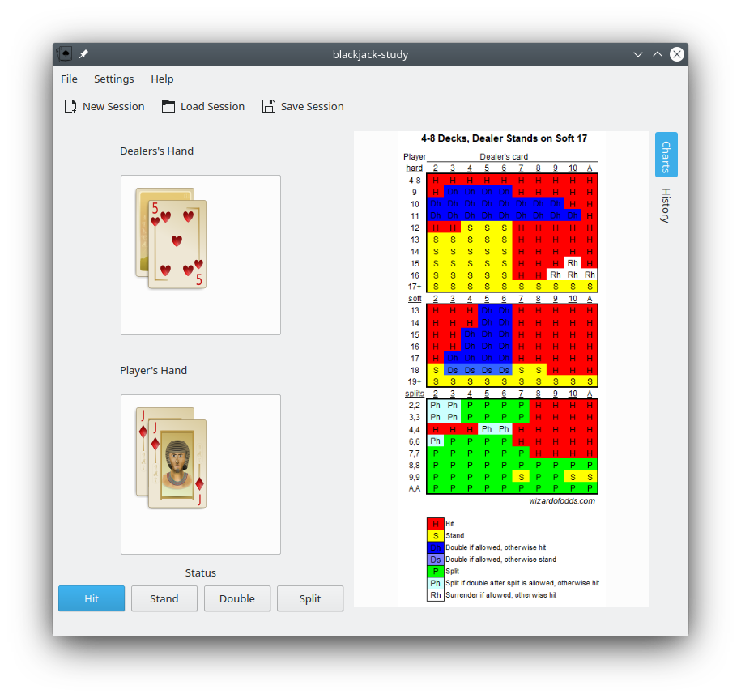
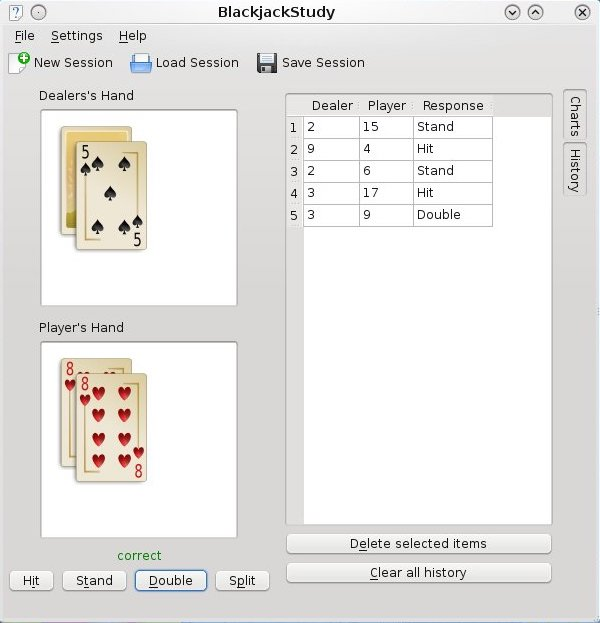

# blackjack-study
Application to study basic strategy for various rule variants of the game of blackjack

## Build & Run

```
mkdir build && cd build
cmake ..
make -j
sudo make install
./source/BlackjackStudy
```

## Format
```
find ./ -name "*.h" -o -name "*.cpp" | xargs clang-format -i --style=file
```

## Screenshots



